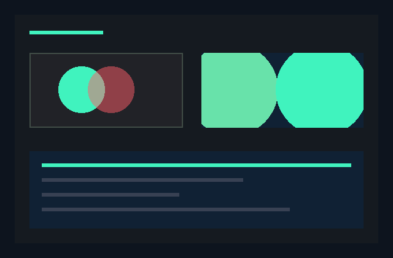

# Chromi

**A 2D renderer written in Bend 2.**

Chromi turns shapes, images, and coverage masks into a composited frame. It is
the drawing layer of the AMAGE UI ecosystem: clipping, color composition, and
rasterization belong here; windows and input belong to
[Ankra](https://github.com/amage-si/ankra).

**Status:** an early **CPU renderer**, tested with **Bend 2.0.35**. Its core and
native tests depend only on the official Bend `Base` library. The interactive
example additionally uses Ankra. GPU rendering is a future goal.



## What works today

- Filled and stroked rectangles, circles, and intersecting rectangular clips.
- Straight RGBA8 source-over composition on an opaque surface.
- Row-major RGBA bitmaps and 8-bit coverage masks, with exact-length validation.
- Explicit logical-to-physical scaling for geometry and image origins.
- A quadtree that retains uniform regions as single leaves.
- A canvas builder that preserves the first error and returns it from `finish`.

The standalone native suite has **44 checks** covering geometry, clipping,
color, masks, invalid input, and the final RGB image conversion. The window
example has also passed a click/color-change check and normal closure on
Linux/XWayland.

## Quick start

Requirements: the [Bend 2 toolchain](https://bend-lang.com) and Clang 14 or newer.
The window example also needs X11 development headers/libraries and an X11 or
XWayland display. No additional AMAGE library is needed for the core tests.

```sh
git clone https://github.com/amage-si/chromi.git Chromi
cd Chromi
export BEND_NO_TELEMETRY=1
bend version
mkdir -p build
bend tests.bend -o build/tests
./build/tests --threads 2 --gpu off
```

For the interactive shape scene, clone Ankra beside Chromi, retaining the
capitalized directory names because Bend imports are case-sensitive:

```sh
git clone https://github.com/amage-si/ankra.git ../Ankra
git -C ../Ankra checkout --detach c94c8b5ff51f49c482a56e1894a741007bc542dd
bend examples/shapes.bend -o build/shapes
./build/shapes --threads 2 --gpu off
```

Click to change the accent color. Close the window normally to exit, or let its
3,600-frame budget expire. See [examples/README.md](examples/README.md) for the
verified Ankra revision and companion checks.

## Draw a frame

```bend
import Base
import ./Chromi/main.bend as C
import ./Chromi/geometry.bend as G

def scene() -> Result<&1, &1, U32 & String, Image>:
  canvas = C.new(320, 200, 1.0, 255)
  canvas = C.fill_rect(canvas, G.Rect{24.0, 24.0, 120.0, 64.0}, 4278190335)
  C.finish(canvas)
```

This creates an opaque black surface and a red rectangle. Colors enter as
`U32` values packed `0xRRGGBBAA`; `finish` converts the completed frame to
`Base.Image` with RGB in the low 24 bits. Pass that image to Ankra to display it.
The code above assumes an application beside the `Chromi` directory.

The canvas is affine: drawing operations consume it and return its next value.
Use the validated functions instead of constructing `Canvas` fields directly.
The [API reference](docs/api.md) defines coordinate, alpha, mask, and error
contracts.

## Current boundaries

Rendering runs on the CPU. There is no GPU backend, shadow pipeline, texture
atlas, image resampling, or bitmap rotation. Rectangles and circles do not have
built-in antialiasing; supplied coverage masks can represent antialiased content.

Blending uses encoded sRGB channels, not linear light. Surfaces require opaque
backgrounds. Bitmap and mask samples each occupy one physical pixel; scaling
an origin does not resize the samples.

Chromi consumes decoded pixels and rasterized coverage. Font parsing, text
shaping, PNG decoding, and SVG parsing are separate ecosystem responsibilities.
They are not bundled into these initial repositories.

In the current Ankra example, the runtime presents through CPU/X11. The window
has a fixed drawing size, and the runtime continues presenting while the scene
is retained. A retained scene is not evidence of an idle event loop.

## Repository map

| Path | Purpose |
| --- | --- |
| [main.bend](main.bend) | Canvas builder and public drawing API. |
| [geometry.bend](geometry.bend) | Bounds, coordinate conversion, and clip intersections. |
| [color.bend](color.bend) | RGBA channels, source-over blending, and coverage. |
| [tree.bend](tree.bend) | Quadtree painting, compaction, sampling, and Base image output. |
| [tests.bend](tests.bend) | Standalone native renderer checks. |
| [examples/shapes.bend](examples/shapes.bend) | Interactive scene using Ankra. |
| [tests/ankra.bend](tests/ankra.bend) | Two companion checks for the example's window dependency. |

## Direction

The initial goal is correct, fast, polished rendering on the development Linux
machine. Next steps include complete UI integration, measured rendering costs,
and a validated GPU path. Compatibility layers follow visible Linux progress.
These goals do not imply current support.

See [CONTRIBUTING.md](CONTRIBUTING.md) for development rules. The API is
experimental and may change. Licensed under either of [Apache License 2.0](LICENSE-APACHE) or [MIT](LICENSE-MIT), at your option.

## License

Licensed under either of

- Apache License, Version 2.0 ([LICENSE-APACHE](LICENSE-APACHE))
- MIT license ([LICENSE-MIT](LICENSE-MIT))

at your option. Unless you explicitly state otherwise, any contribution
intentionally submitted for inclusion in this work, as defined in the
Apache-2.0 license, shall be dual licensed as above, without any additional
terms or conditions.
