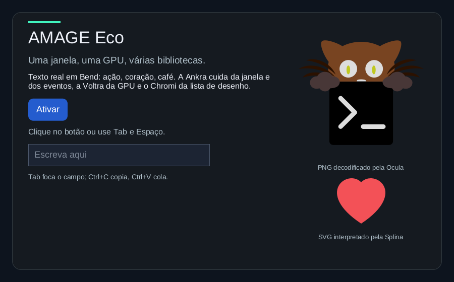

# Chromi

**A 2D renderer written in Bend 2.**

Chromi turns shapes, images, and coverage masks into a composited frame. It is
the drawing layer of the AMAGE UI ecosystem: clipping, color composition, and
rasterization belong here; windows and input belong to
[Ankra](https://github.com/amage-si/ankra), GPU access to
[Voltra](https://github.com/amage-si/voltra).

**Status:** an early renderer with two paths, tested with **Bend 2.0.35**. A
frame is recorded as a **draw list**; the **CPU reference** paints it into a
quadtree canvas, and the **GPU path** draws it through Voltra. Both produce the
same bytes: every scene in the GPU checks compared equal, pixel for pixel. The
core and its native tests depend only on the official Bend `Base` library.



The capture above is `examples/eco`, captured from its own window only. Text
comes from Runika, Syllo and Dithra; the button from Mokko and Kairo; the
layout from Tessra; the PNG is decoded by Ocula and the SVG parsed by Splina.
The capture equals Chromi's CPU reference of the same frame in all 504,000
pixels.

## What works today

- Filled and stroked rectangles, circles, and intersecting rectangular clips.
- **Rounded rectangles and rounded borders** with antialiased corners: 4x4
  samples per pixel on 1/8-pixel geometry, by integer rules shared with
  Voltra's shader.
- Straight RGBA8 source-over composition on an opaque surface.
- Row-major RGBA bitmaps and 8-bit coverage masks, with exact-length
  validation, either per call or once (`S.rgba`, `S.coverage`) for pixels drawn
  in every frame.
- Explicit logical-to-physical scaling for geometry and image origins.
- A quadtree canvas that retains uniform regions as single leaves.
- **Draw lists** (`scene.bend`): the canvas's validated calls recorded as
  physical operations, resolved once by the canvas's own rules.
- **CPU reference** (`replay.bend`): a draw list painted into the canvas with
  its blending, as a `Base.Image` or a flat RGBA array.
- **GPU path** (`gpu.bend`): one Voltra quad per operation, bitmaps and masks
  uploaded once into an atlas by key, one draw call per frame.

How it was verified:

- **60 native checks** (`tests.bend`, no display): geometry, clipping, color,
  masks, invalid input, the final RGB conversion, and the draw list (replaying
  a scene equals drawing the same calls on the canvas, operation recording,
  rounded-box quantization, coverage rules, validated pixels).
- **7 GPU checks** (`gpu_tests.bend`, offscreen through Voltra, no display):
  four scenes (fills, borders, clips, translucency, fractional and negative
  edges; rounded boxes and borders; masks and bitmaps through the atlas,
  clipped and partly off the surface; a mixed UI frame) drawn on the GPU and
  compared with the CPU reference: **0 of 64,000 pixels differ** in each.
  Atlas reuse (no second upload of a key) and overflow detection are checked,
  and a negative control confirms the comparison sees a different scene
  (38,364 differing pixels).
- **Integrated demo on a real window** (`examples/eco/main.bend`): captures at
  900x560, 1100x700 and 640x760 (after the window manager resized it, so
  Tessra laid it out again, side by side or stacked) each equal the CPU
  reference at that size (`magick compare -metric AE` 0). Synthetic input sent
  only to its window: a click activated the button once, Space once, Enter
  once. It closed normally with 0 native objects left.
- The shape example (`examples/shapes.bend`, official window) still builds;
  `tests/ankra.bend` passes its 2 companion checks.
- **7 text cache checks** (`examples/eco/text_tests.bend`): the demo's text
  (`examples/eco/text.bend`) keeps glyph masks by atlas key and prepared runs
  by (text, size, width) in Voltra's key map; cached runs equal runs prepared
  from scratch bit for bit, repeated texts are hits, a new width is a miss, a
  font with another checksum starts an empty cache, 600 changing texts stay
  within two generations of 256 runs, and runs sharing a hash never mix.
  Rebuilding the demo's model after an activation costs ~0.1 ms of Bend work
  (it was ~4 ms).

## Measurements

The integrated demo's scene at 900x560, redrawn 300 times with the button's
hover state toggling, three runs per path. Method and raw output:
[docs/bench.md](docs/bench.md).

| Path | Wall time per redraw | CPU per redraw | Idle (10 s) | Startup to first frame | Resident memory |
| --- | --- | --- | --- | --- | --- |
| CPU raster + official window (`XPutImage`, 60 Hz) | 72–86 ms | 72–85 ms | ~58 frames/s presented, 75–80 CPU ticks, main thread ~300 wakeups/s | 417–498 ms | 27–35 MiB |
| Draw list + Voltra, FIFO | 5.1–6.7 ms | 1.6–1.7 ms | 0 frames, 2–3 CPU ticks, main thread 0–3 wakeups | 662–888 ms | 96–105 MiB |
| Draw list + Voltra, IMMEDIATE | 1.4–1.5 ms | 1.4–1.5 ms | | | |

Interactive redraws in the demo (scene, planning and GPU submission) took
1–4 ms. The GPU path starts about 0.25–0.45 s later (Vulkan instance, device
and pipeline creation) and holds about 70 MiB more (the NVIDIA driver).

## Quick start

Requirements: the [Bend 2 toolchain](https://bend-lang.com) and Clang 14 or newer.
The core and its tests need nothing else.

```sh
git clone https://github.com/amage-si/chromi.git Chromi
cd Chromi
export BEND_NO_TELEMETRY=1
bend version
mkdir -p build
bend tests.bend -o build/tests
./build/tests --threads 2 --gpu off
```

The GPU path and the demos need the sibling repositories beside Chromi, with
their capitalized names (Bend imports are case-sensitive), a Vulkan 1.3 driver
and an X11 or XWayland display:

```sh
cd ..
for r in ankra voltra kairo tessra mokko runika syllo dithra ocula splina; do
  git clone https://github.com/amage-si/$r.git "$(echo ${r:0:1} | tr a-z A-Z)${r:1}"
done
cd Chromi
bend gpu_tests.bend -o build/gpu_tests                 # GPU, no display
./build/gpu_tests --threads 2 --gpu off
bend examples/eco/main.bend -o build/eco              # about 85 s, 3.8 GB peak
./build/eco --threads 2 --gpu off                      # run from Chromi/
```

Click the button, use Tab and Space or Enter, resize the window, close it
normally. The program prints one line per redraw and per input batch. See
[examples/README.md](examples/README.md) for the other examples, the CPU
variant and the benchmarks.

## Draw a frame

```bend
import Base
import ./Chromi/scene.bend as S
import ./Chromi/replay.bend as R
import ./Chromi/geometry.bend as G

def scene() -> S.Scene:
  s = S.new(320, 200, 1.0, 255)
  s = S.round_rect(s, G.Rect{24.0, 24.0, 120.0, 64.0}, 12.0, 4278190335)
  S.border(s, G.Rect{24.0, 24.0, 120.0, 64.0}, 12.0, 2.0, 4294967295)

def image() -> Result<&1, &1, U32 & String, Image>:
  R.image(scene())
```

This records a red rounded rectangle with a white border on an opaque black
surface; `R.image` paints it on the CPU into a `Base.Image` (RGB in the low 24
bits) for the official window. With Voltra, `Gpu.draw(renderer, scene())`
draws the same list on the GPU (`import ./Chromi/gpu.bend as Gpu`).

Colors enter as `U32` values packed `0xRRGGBBAA`. Builders are values: each
call returns the next scene (or canvas); a failure keeps the first error.
The [API reference](docs/api.md) defines coordinate, alpha, mask, rounding and
error contracts. The immediate canvas API (`main.bend`) remains for CPU-only
drawing.

## Current boundaries

- Blending uses encoded sRGB channels, not linear light. Surfaces require
  opaque backgrounds.
- Rectangles and circles have no built-in antialiasing; rounded rectangles
  and borders are antialiased with 16 coverage levels. Supplied coverage
  masks can represent antialiased content.
- Bitmap and mask samples each occupy one physical pixel; scaling an origin
  does not resize the samples. No image resampling, rotation or shadows.
- The GPU path draws the whole frame on every redraw (no damage regions);
  circles are not part of the draw list yet (canvas only).
- The atlas is one 1024x1024 texture; when a frame needs more, it starts over
  with that frame's content, and an item larger than the atlas is not drawn.
- Pixel equality between the paths was verified on one GPU and driver.
- Font parsing, text shaping, PNG decoding and SVG parsing are separate
  ecosystem libraries.

## Repository map

| Path | Purpose |
| --- | --- |
| [main.bend](main.bend) | Canvas builder and immediate drawing API (CPU). |
| [scene.bend](scene.bend) | Draw lists: the canvas's calls recorded as physical operations. |
| [replay.bend](replay.bend) | CPU reference renderer of draw lists; coverage rules; flat pixels. |
| [gpu.bend](gpu.bend) | GPU renderer of draw lists through Voltra (quads, atlas). |
| [geometry.bend](geometry.bend) | Bounds, coordinate conversion, and clip intersections. |
| [color.bend](color.bend) | RGBA channels, source-over blending, and coverage. |
| [tree.bend](tree.bend) | Quadtree painting, compaction, sampling, and Base image output. |
| [tests.bend](tests.bend) | Native renderer checks (no display, no GPU). |
| [gpu_tests.bend](gpu_tests.bend) | GPU against CPU, pixel by pixel (GPU, no display). |
| [examples/](examples/) | The integrated demo and its CPU variant, benchmarks, the shape scene; `eco/text.bend` and `eco/text_tests.bend` are the demo's cached text. |
| [tests/ankra.bend](tests/ankra.bend) | Two companion checks for the official-window example. |
| [docs/](docs/) | API and benchmark references. |

## Direction

Next: damage-aware redraws, circles and paths in draw lists, linear-light
blending as an option, and more components through Mokko. Compatibility layers
follow visible Linux progress. These goals do not imply current support.

See [CONTRIBUTING.md](CONTRIBUTING.md) for development rules. The API is
experimental and may change. Licensed under either of [Apache License 2.0](LICENSE-APACHE) or [MIT](LICENSE-MIT), at your option.

## License

Licensed under either of

- Apache License, Version 2.0 ([LICENSE-APACHE](LICENSE-APACHE))
- MIT license ([LICENSE-MIT](LICENSE-MIT))

at your option. Unless you explicitly state otherwise, any contribution
intentionally submitted for inclusion in this work, as defined in the
Apache-2.0 license, shall be dual licensed as above, without any additional
terms or conditions.
